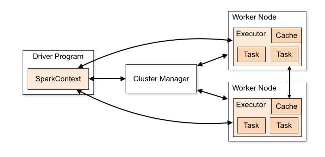

## 1. 

'''
Apache spark to silnik do rozproszongo przetwarzania danych. Spark przetwarza dane głównie w pamięci. 

# Architektura klastra
Spark działa w modelu Master-Worker.

Driver Node - Głównyy proces aplikacji. Tworzy obiekt SparkSession, przekształca kod w graf operacji DAG. Planuje zadania i je rodziela pomiędzy węzły wykonawcze. 

Cluster Manager - Zarządza przydzielaniem zasobów w klastrze. 

Executores - Procesy działające na węzłach typu worker przechowują dane w pamięci/dyskach oraz wykonują przydzielona przez Drivera zadania. 

'''

# 
Struktura i rozmiar grafu DAG nie zaleza od sprzetu lecz wyłącznie od logiki w kodzie.

Graf DAG (Plan logiczny) - okresla co i w jakiej kolejnosci ma sie stac z danymu (read -> filter ...). Dzieli sie na etapy (Stages) których liczba zalezy od tego czy w kodzie wystepuja operacje przetasowania danych (Shuffle np groupby, join)

Zadania (Task - fizyczna egzekucja) - to konkretne jednostki pracy. Kazdy Stage z grafu DAG jest dzielony na tyle zadan ile jest partycji danych

partycja danych - To logiczny wycinek całego zbioru danych , który znajduje sie w pamieci jednej maszyny i jest przetwarzany jako jedna calosc. 

Przykladowo jest dataframe zostal podzielony na 100 partycji a klaster ma do dyspozycji 10 rdzczeniu cpu to spark wykona 10 procesow obliczeniowych przetwarzajac po 10 partycji jednoczesnie. 

W przypadku dwoch maszyn 10 wątkowych, jesli zalozymy ze zbior zostal podzielony na 8 partycji to spark przydzieli 4 partycje do maszyny A i 4 do maszyny B. 
# 

W przypadku wczytywania danych np poprzez
spark.read.parquet(sciezka_do_danych)

Nie nastepuje fizyczne wczytanie danych do pamieci ram, spark odczytuje jedynie metadane pliku (naglowki, typy kolumn). 

Nastepnie odbywa sie podzial na partycje ktory odbywa sie na podstawie rozmiaru pliku na dysku/pamieci. 

Proces shuffle w sparku to proces przesyłania danych pomiedzy partycjami (i czesto miedzy roznymi fizycznymi maszynami w sieci) tak aby wiersze o tym samym kluczu trafił w jedno miejsce. (Podczas shuffle dane tymczasowe sa zapisywane na dysku lokalnym workera.) Najdrozsza operacja w sparku.

Jak budowane sa etapy (stages) w DAGU. 
- POjedynczy Stage tworzy się wokół granic wyznaczonych przez shuffle. Spark laczy wszzystkie operacje typu Narrow( które nie wymagaja przetasowania) w jeden wspolny Stage. 

Np. 
df = spark.read.csv("dane.csv")                 # 1. 
df_filtered = df.filter(df["Pensja"] > 3000)    # 2. 
df_grouped = df_filtered.groupBy("Dzial")       # 3. 
df_result = df_grouped.agg({"Pensja": "avg"})   # 4.
df_result.show()                                # 5.

STAGE 1 :
┌─────────────────────────────────────────────────────────────┐
│ 1. Odczyt pliku z dysku (Pojedyncze wiersze)                │
│ 2. Od razu filtrowanie (Pensja > 3000) na tej samej partycji│
│ 3. Częściowe zsumowanie i przygotowanie do wysyłki          │
└──────────────────────────────┬──────────────────────────────┘
                               │
                            SHUFFLE 
                               │
                               ▼
STAGE 2:
┌─────────────────────────────────────────────────────────────┐
│ 4. Odebranie przetasowanych danych według działów           │
│ 5. Wyliczenie ostatecznej średniej dla każdego działu       │
│ 6. Zwrócenie wyników do konsoli (.show)                     │
└─────────────────────────────────────────────────────────────┘